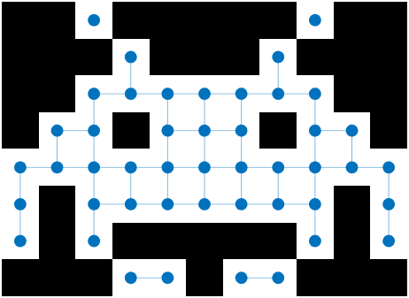

# *bwgraph*: Create a graph of connected pixels in 2D images or 3D volumes.

`bwgraph` can be used to find the shortest path between 2 pixels. See [Examples](#examples).

## Syntax

`G = bwgraph( bw, Name=Value )`

### Inputs

| Positional Argument | Description |
| :--- | :--- |
| `bw` | Binary image, given as a 2D or 3D, numeric or logical array. For numeric input, non-zero pixels are considered to be `1` (`true`). |
| **Name-Value Argument** | **Description** |
| `Connectivity` | Pixel connectivity, defining whether pixels are connected when they share either a face, edge, or corner. For a 2D `bw`, valid values are `4` (edge) and `8` (corner), and in 3D, `6` (face), `18` (edge) and `26` (corner). Default is the maximal connectivity, i.e., `8` or `26`. |
| `NodeWeights` | Node weights, given for each element of `bw`. For example, the node weight could represent the distance between that pixel and the nearest non-zero pixel of `bw`, as calculated with `bwdist`. Edge weights for the graph are set as the mean node weight of the two connected pixels. Numeric array with the same size as `bw`. |

### Outputs

| Argument | Description |
| --- | --- |
| `G` | `graph` object with nodes for all pixels of `bw` and edges between connected non-zero pixels. By default, edge weights are the Euclidean distance between the centers of connected pixels. The indices of the graph's nodes are equivalent to the linear indices of the pixels in `bw`. Therefore, use `sub2ind` and `ind2sub` to convert between pixel subscripts and node indices. |

## Examples

Please see [*examples.mlx*](examples.mlx) or [*examples.pdf*](examples.pdf).

## Compatibility, License and Citation

Created in 2022b. Compatible with MATLAB release 2019b and later. Compatible with all platforms.

Published under MIT License (see [*LICENSE.txt*](LICENSE.txt)).

Please cite George Abrahams (https://github.com/WD40andTape/bwgraph, https://www.linkedin.com/in/georgeabrahams).
